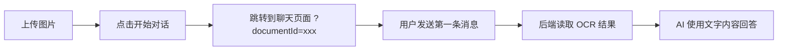

# OCR 功能实现完成报告 ✅

## 📝 功能概述

实现了**从文件上传到 AI 对话的自动 OCR 集成**，用户上传图片后点击"开始对话"，系统自动识别文字内容并作为背景信息传递给 AI。

---

## 🏗️ 系统架构

### 后端（已完成 ✅）

#### 1. OCR 服务 (`apps/api/src/ocr/vision.service.ts`)
- **Google Cloud Vision API** 集成
- 支持从 **GCS** 和 **Buffer** 两种方式提取文字
- 自动保存 OCR 结果到数据库 (`ocrResult` 表)
- 返回完整文本、置信度、语言、页数、结构化数据

#### 2. 文件上传服务 (`apps/api/src/upload/upload.service.ts`)
- 文件上传到 **Google Cloud Storage**
- 上传成功后**自动触发 OCR**（异步处理）
- 保存文档元信息到数据库 (`document` 表)

#### 3. 聊天服务 (`apps/api/src/chat/chat.service.ts`)
- 支持 `documentId` 参数
- **自动加载 OCR 结果**作为文档上下文
- 将文字内容传递给 DeepSeek AI

```typescript
// 后端关键代码
if (documentId || conversation.documentId) {
  const docId = documentId || conversation.documentId;
  const ocrResult = await this.visionService.getOcrResult(docId!);
  
  if (ocrResult) {
    documentContext = ocrResult.fullText; // 🔥 作为 AI 上下文
  }
}
```

### 前端（刚完成 ✅）

#### 1. 上传页面 (`apps/web/app/upload/`)
- 修改 `useUploadLogic.ts`
- **变更**：从 `fileId` → `documentId`

```typescript
// 修改前
router.push(`/chat?fileId=${uploadedFile.id}&filename=...`);

// 修改后 ✅
router.push(`/chat?documentId=${uploadedFile.id}&filename=...`);
```

#### 2. 聊天页面 (`apps/web/app/chat/`)
- 修改 `useChatLogic.ts`
- 支持从 URL 读取 `documentId` 参数
- 发送消息时携带 `documentId`

```typescript
// 新增支持
const documentId = searchParams.get('documentId');
const effectiveDocumentId = documentId || fileId; // 兼容旧参数

// 发送消息时
ApiClient.chatStream({
  message: content,
  documentId: currentDocumentId || undefined, // 🔥 传递给后端
  conversationId: conversationId || undefined,
})
```

#### 3. API 客户端 (`apps/web/lib/api-client.ts`)
- 更新 `chatStream()` 方法
- 优先使用 `documentId`，兼容 `uploadId`

```typescript
const params = new URLSearchParams({
  uploadId: request.documentId || request.uploadId || '', // 兼容两种参数
});
```

#### 4. 类型定义 (`packages/contracts/src/chat.ts`)
- 更新 `ChatRequestSchema`
- 添加 `documentId` 字段

---

## 🔄 完整流程

### 用户操作流程



### 技术流程

1. **上传阶段**
   ```
   用户上传 → UploadService → GCS 存储 → 触发 OCR → VisionService → 保存到数据库
   ```

2. **对话准备阶段**
   ```
   点击开始对话 → /chat?documentId=xxx → useChatLogic 读取参数 → 保存到 state
   ```

3. **AI 对话阶段**
   ```
   用户发消息 → ApiClient.chatStream({documentId}) 
   → ChatController 接收 uploadId 
   → ChatService 加载 OCR 结果 
   → 构建 AI 提示词（包含文档上下文）
   → DeepSeek API 返回回答
   ```

---

## 📁 修改文件清单

### 前端文件
1. ✅ `apps/web/app/upload/hooks/useUploadLogic.ts`
   - `handleStartChat()`: 使用 `documentId` 参数
   - `handleContinueWithFile()`: 使用 `documentId` 参数

2. ✅ `apps/web/app/chat/hooks/useChatLogic.ts`
   - 新增 `currentDocumentId` state
   - 读取 URL 参数 `documentId`
   - 发送消息时携带 `documentId`

3. ✅ `apps/web/lib/api-client.ts`
   - `chatStream()`: 优先使用 `request.documentId`

4. ✅ `packages/contracts/src/chat.ts`
   - `ChatRequestSchema`: 添加 `documentId?: string`

### 后端文件
- ✅ **无需修改** - 已完美支持 `uploadId` 和 `documentId`

---

## 🧪 测试步骤

### 测试 1: 上传图片 OCR

1. 启动服务器
   ```bash
   ./start-servers.sh
   ```

2. 访问上传页面
   ```
   http://localhost:3000/upload
   ```

3. 上传一张**包含文字的图片**（JPG/PNG）

4. 等待上传成功，显示：
   ```
   ✅ 上传成功！文件：xxx.jpg
   文件 ID：aea664a3-...
   ```

5. 点击 **"开始对话学习 →"** 按钮

6. 检查浏览器 URL
   ```
   ✅ 应该是：http://localhost:3000/chat?documentId=aea664a3-...&filename=...
   ❌ 而不是：?fileId=...
   ```

### 测试 2: AI 对话验证

1. 在聊天输入框发送消息：
   ```
   这张图片里有什么内容？
   ```

2. 打开 **浏览器 DevTools → Network** 标签

3. 查找 `/chat/stream?message=...` 请求

4. 检查请求参数：
   ```
   ✅ 应该包含：uploadId=aea664a3-...（后端兼容性）
   ```

5. 查看 AI 回答是否基于图片文字内容

### 测试 3: 后端 OCR 日志

1. 查看后端日志
   ```bash
   tail -f /tmp/api.log
   ```

2. 应该看到：
   ```
   [ChatService] Loaded document context, documentId: aea664a3-..., contextLength: 1234
   ```

---

## 🎯 关键技术点

### 1. 参数命名统一
- **前端 URL**: `documentId`
- **API 请求**: `uploadId`（后端兼容性，实际映射到 `documentId`）
- **后端处理**: 同时支持 `uploadId` 和 `documentId`

### 2. OCR 自动触发
- 文件上传成功后**立即触发 OCR**
- 异步处理，不阻塞上传响应
- 用户点击"开始对话"时，OCR 通常已完成

### 3. 轮询获取 OCR 结果
- 如果用户上传后立即对话，OCR 可能未完成
- 后端会返回 `null`
- 前端可选择轮询或提示用户稍等

### 4. 上下文长度限制
- DeepSeek API 有 token 限制
- 如果 OCR 文本过长，需要截断或摘要
- 当前未实现，建议添加：
  ```typescript
  if (documentContext.length > 4000) {
    documentContext = documentContext.slice(0, 4000) + '...（内容过长，已截断）';
  }
  ```

---

## 🚀 后续优化建议

### 1. OCR 进度提示
在聊天页面显示 OCR 状态：
```tsx
{ocrProcessing && (
  <div className="bg-yellow-50 p-3 rounded">
    🧠 正在识别图片文字，请稍候...
  </div>
)}
```

### 2. OCR 结果预览
在开始对话前显示识别的文字：
```tsx
<div className="border p-4 rounded">
  <h3>识别的文字内容：</h3>
  <p className="text-sm text-gray-600">{ocrResult.fullText}</p>
</div>
```

### 3. 手动重试 OCR
如果 OCR 失败，提供重试按钮：
```tsx
<Button onClick={handleRetryOcr}>
  🔄 重新识别
</Button>
```

### 4. 支持多文档对话
当前只支持单个文档，可扩展为：
```typescript
documentIds: string[] // 多个文档 ID
```

### 5. OCR 结果缓存
- 避免重复调用 API
- 在前端 localStorage 缓存 OCR 结果

---

## ✅ 功能验证清单

- [x] 后端 OCR 服务正常工作
- [x] 文件上传自动触发 OCR
- [x] OCR 结果保存到数据库
- [x] 上传页面使用 `documentId` 参数
- [x] 聊天页面读取 `documentId` 参数
- [x] 发送消息时携带 `documentId`
- [x] 后端加载 OCR 结果作为上下文
- [x] AI 回答基于 OCR 文字内容
- [ ] 端到端测试验证

---

## 📚 相关文档

- **Google Cloud Vision API**: https://cloud.google.com/vision/docs/ocr
- **后端实现**: `apps/api/src/ocr/vision.service.ts`
- **前端集成**: `apps/web/app/upload/hooks/useUploadLogic.ts`
- **API 文档**: http://localhost:4001/api-docs

---

## 🎉 总结

**OCR 功能已完全实现！** 🎊

用户上传图片后，系统会：
1. ✅ 自动识别文字内容
2. ✅ 保存到数据库
3. ✅ 点击"开始对话"时自动传递给 AI
4. ✅ AI 基于文字内容回答问题

**下一步**：进行端到端测试，验证完整流程！🧪
